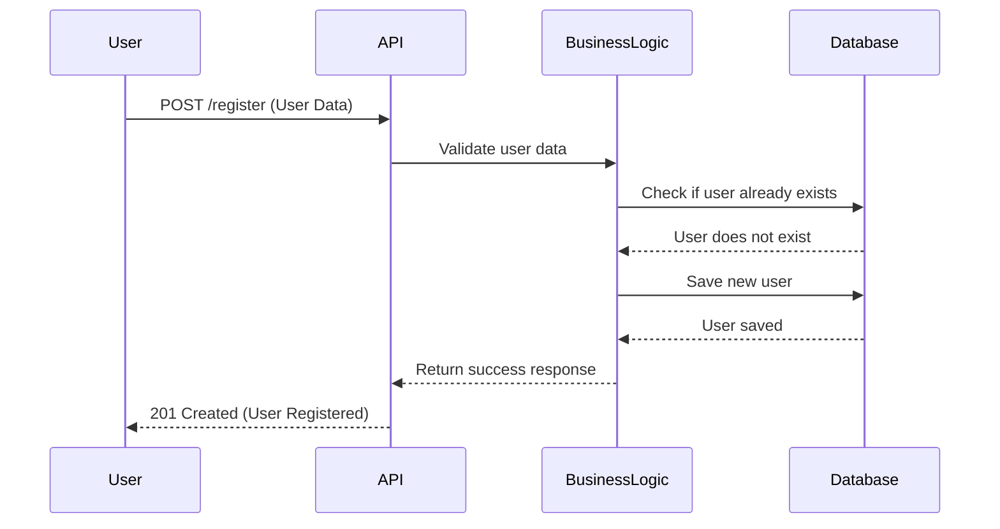
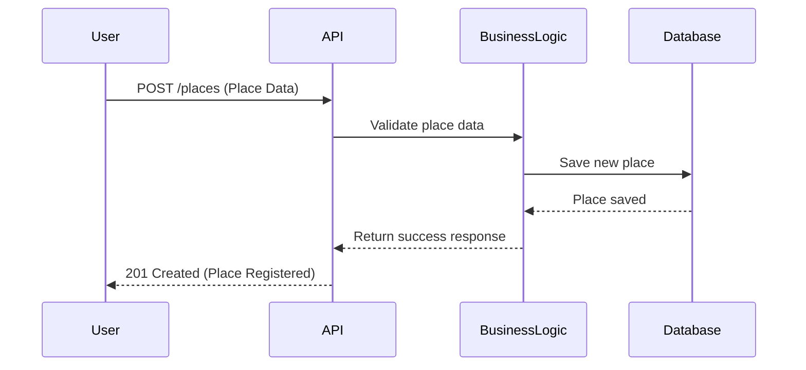
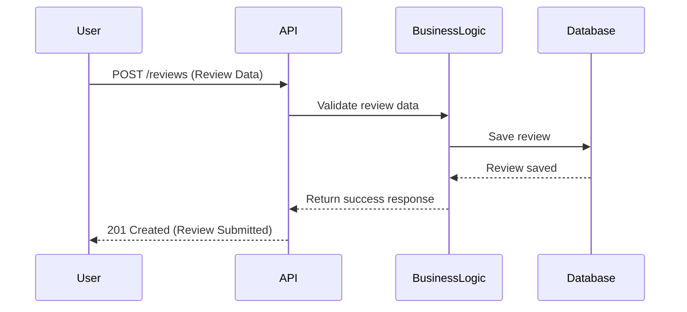
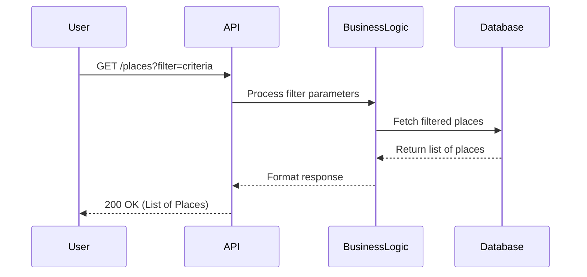

# Sequence Diagrams for API Calls

## 1. User Registration
This diagram illustrates the interaction flow when a user registers for a new account.

---

## 2. Place Creation
This diagram shows how a user creates a new place listing.

---

## 3. Review Submission
This diagram represents the process when a user submits a review for a place.

---

## 4. Fetching a List of Places
This diagram shows the process of retrieving a list of places based on filters.

---

## Explanatory Notes
### 1. **User Registration**
- The API receives user data and validates it.
- The Business Logic checks if the user already exists before saving.
- If the user is new, they are saved in the database, and a success response is returned.

### 2. **Place Creation**
- The API receives place details and validates them.
- The Business Logic ensures all required data is provided.
- The new place is saved in the database, and a success response is returned.

### 3. **Review Submission**
- The API processes a user’s review request.
- The Business Logic ensures the review is valid and saves it to the database.
- A success response is returned to the user.

### 4. **Fetching a List of Places**
- The API handles user requests with filters.
- The Business Logic processes filters and queries the database.
- The database returns a list of places, which is formatted and sent back to the user.

These sequence diagrams provide a **clear view** of how different layers interact in handling API requests.

