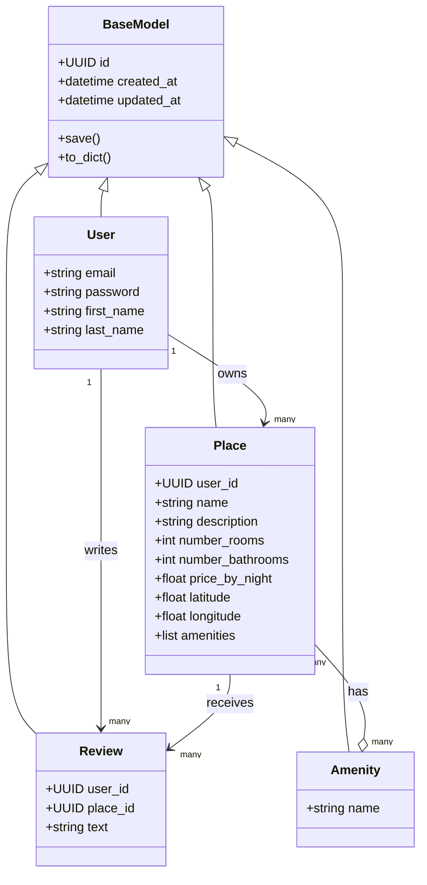

```mermaid
classDiagram
    class BaseModel {
        +UUID id
        +datetime created_at
        +datetime updated_at
        +save()
        +to_dict()
    }

    class User {
        +string email
        +string password
        +string first_name
        +string last_name
    }

    class Place {
        +UUID user_id
        +string name
        +string description
        +int number_rooms
        +int number_bathrooms
        +float price_by_night
        +float latitude
        +float longitude
        +list amenities
    }

    class Review {
        +UUID user_id
        +UUID place_id
        +string text
    }

    class Amenity {
        +string name
    }

    BaseModel <|-- User
    BaseModel <|-- Place
    BaseModel <|-- Review
    BaseModel <|-- Amenity

    User "1" --> "many" Place : owns
    User "1" --> "many" Review : writes
    Place "1" --> "many" Review : receives
    Place "many" --o "many" Amenity : has
```

