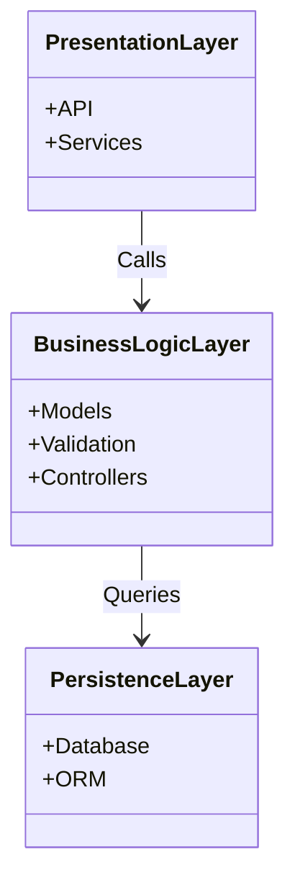

# High-Level Package Diagram

## Overview
This diagram represents the high-level package architecture of the HBnB application. It illustrates the major layers of the system and their relationships.

## Explanation
- **Presentation Layer**: Handles user interactions via API and services.
- **Business Logic Layer**: Contains core application logic, models, validation, and controllers.
- **Persistence Layer**: Manages data storage and retrieval using a database and ORM.

